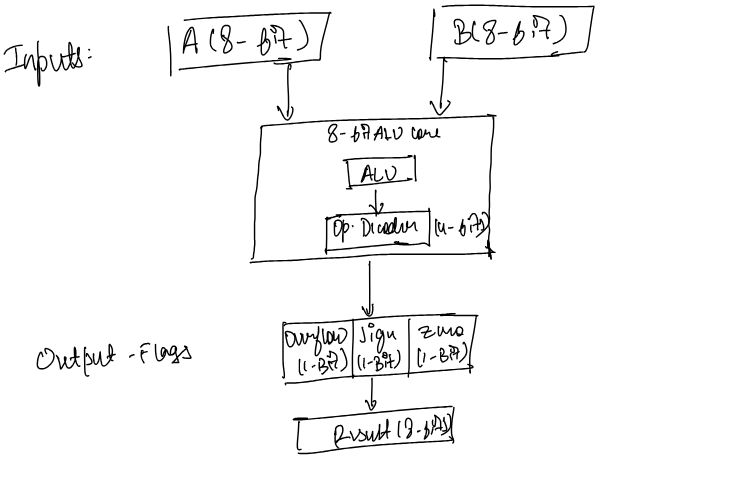

# ALU 

I am going to use the following ALU architecture (1): 

## Opcode Table

| Operation     | OpCode |
|---------------|--------|
| ADD           | 00000  |
| SUB           | 00001  |
| MUL           | 00010  |
| DIV           | 00011  |
| Shift Left    | 00100  |
| Shift Right   | 00101  |
| Rotate Left   | 00110  |
| Rotate Right  | 00111  |
| AND           | 01000  |
| OR            | 01001  |
| XOR           | 01010  |
| NOR           | 01011  |
| NAND          | 01100  |
| XNOR          | 01101  |
| EQ (Equal)    | 01110  |
| NEQ (Not Eq.) | 01111  |
| LT (Less Than)| 10000  |
| LTE (≤)       | 10001  |
| GT (Greater)  | 10010  |
| GTE (≥)       | 10011  |

## References

[1] Huang,Z. (2023). Design and implementation of an 8-bit ALU based on verilog HDL. Theoretical and Natural Science,14,180-185.